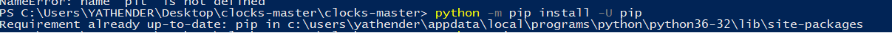
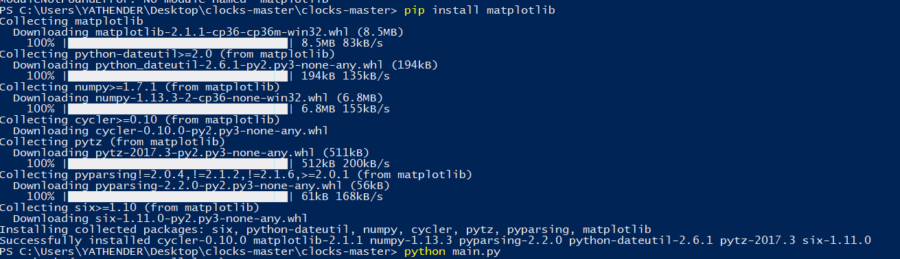
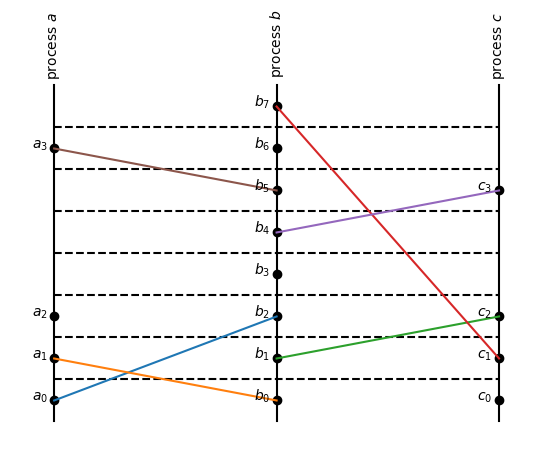
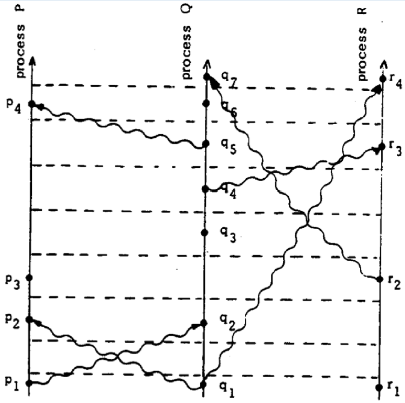

## Lamports Algorithm
Lamport's Logical Clocks

Here I would show you the implementation of Lamport's algorithm in Python 3.

First we need to install "matplotlib"

To instal matplotlib follow below instructions :

Step 1: update pip

python -m pip install -U pip

| ------------------ |
|    |

this will update pip

Step 2: enter the below command to install matplotlib

 pip install matplotlib
 
 | ------------------ |
 |    |

After installation run main.py from the folder
by

python main.py

The main file runs baes on lamport.py

The input is provided in the main.py file as follows

import lamport

def f(clock):
    clock.send(1)
    clock.recv(1)
    clock.local()
    clock.recv(1)

def g(clock):
    clock.send(0)
    clock.send(2)
    clock.recv(0)
    clock.local()
    clock.send(2)
    clock.send(0)
    clock.local()
    clock.recv(2)

def h(clock):
    clock.local()
    clock.send(1)
    clock.recv(1)
    clock.recv(1)

| `python main.py`   | Lamport's paper     |
| ------------------ | ------------------- |
|  |  |

we define three processes f ,g ,h

each process has three types of events
1) send event
2) recv event
3) local event 

For example; clock.send(1) ---> send event from a process to process 1
             clock.send(0) ---> send event from a process to process 0
             clock.send(2) ---> send event from a process to process 2
             
             clock.recv(1) ---> send event from a process 1
             clock.local() ---> it is a local event
             
             if it is clear lets have a look at  Lamports paper above
             lets take prcess a(here f)
             it has send(1), recv(1), local() and recv(1)
             
             thus we can define processes in main.py
             
 On running main.py we can get the output as clock.png file as shown above.
              
